# Project Part II

Yuan Chen

yc5118@nyu.edu

https://github.com/yuanchen98/CSGY6083-Project

## Schema Design

### Assumptions

1. Each **location** has a unique locationId. And each location has three other attributes: city, state and country.

2. For **status level**, there are several status levels. Each status level has a points range, specified by its low points and high points (low points is inclusive and high points is exclusive). For example, 0 points to 1 points is defined as basic, and 1 points to 2 points is defined as advanced, etc. 

3. Each **user** has a unique userId. One user has one adress associated with it (by using attribute locationIs), so locationId would be a foreign key. Each user has it statusPoints, which is calculated by adding the total number of thumbs they get and the total number of best answers they get. Also, a user has username, password and profile.

4. I designed a 2-level hierarchy of topics, **maincategory** and **subcategory**. There are several first level maincategories, like study, culture, arts, etc. And in each maincategory, there are several subcategories. For example, in maincategory study, there are several subcategories like computer science, maths, etc. 

   Each maincategory has unique categoryId, and it also has a cateogory name. 

   For **subcategory**, I **changed** the schema for subcategory from part I a little bit. Subcategory become a strong identity in part II. Each subcategory has a subcategoryId, a subcategoryName and categoryId. SubcategoryId is the primary key of a subcategory, and categoryId and a foreign key that refers to the category table's categoryId.

5. Each **question** has a unique questionId. A question is posted by a user. A question belongs to a (maincategory, subcategory), so (maincategory, subcategory) is a foregin key. Also, a question has a title, a question body, a post time.

6. Each **answer** has a unique answerId. An answer is replied to a question, so questionId is a foreign key. Also, an answer has a post time and answer body.

7. Each question may have one **best answer**. Best answer is a one to one relationship (one question to one answer), and questionId and answerId are foreign keys.

8. A user can give thumbs to many answers, and an answer can receive thumbs from different users. I also **changed** the schema of **thumb** a little bit. Each thumb has a thumbId, userId, answerId. A thumb is identified by the thumbId, so thumbId is the primary key, and both userId and answerId are foregin keys. Thumb is many to one relationship to user, and thumb is also many to one relationship to answer.

### E-R Diagram

- A location can have many users, and a user can have only one location, so location to user is one to many relation.
- Several subcategorys belongs to a maincategory, and a maincategory can have several  subcategories. So subcategroy to maincategory is many to one relationship.
- A question is posted by only one user and it belongs to only one subcategory. So questions to user and question to subcategory are both many to one relation.
- Each answer replies to one question, and is posted by a user. A question can have several answers and a user can post many answers. So, answer to question is many to one relation, and answer to user is many to one relation.
- A user can give many thumbs, so thumbs to user is many to one relationship.  And an answer can receive many thumbs, so thumbs to answers is also many to one relationship.
- A question only have one best answer,  and a best answer only belongs to one question, so it's a one to one relation.

### Relation Schemas

**Location:** (<u>locationId</u>, city, state, country)

**User:** (<u>userId,</u> username, pwd, profile, statusPoints, locationId)

locationId references Location(locationId)

**StatusLevel:** (<u>levelId</u>, levelName, lowPoints, highPoints) 

**MainCategory:** (<u>categoryId</u>, categoryName)

**SubCategory:** (<u>subcategoryId</u>, categoryId, subcategoryName)

categoryId references Category(categoryId)

**Questions:** (<u>questionId</u>, userId, categoryId, subcategoryId, title, questionBody, postTime)

userId references User(userId)

(categoryId, subcategoryId) references SubCategory(categoryId, subcategoryId)

**Answers:** (<u>answerId</u>, questionId, userId, postTime, answerBody)

questionId references Questions(questionId)

userId reference User(userId)

**Thumbs:** (<u>thumbId</u>, answerId, userId)

answerId references Answers(answerId)

userId references User(userId)

**BestAnswer:** (<u>questionId, answerId</u>)

questionId references Questions(questionId)

answerId references Answer(answerId)

- Note for **BestAnswer** table: I create a seperate table for best answer, because even right now I decide one question can only have only one best answer, it's possible that we want to say that one question can have several best answers in the future. A seperate table for best answers is better if the design of the best answers is possible to change in the future.

### Sample Table

- Location:

  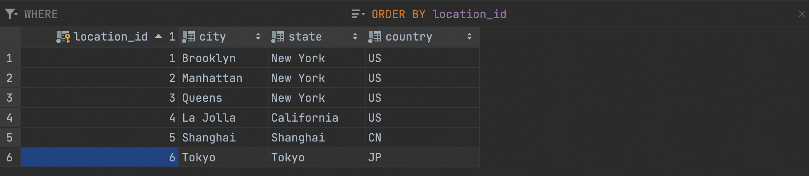

  

- User:

  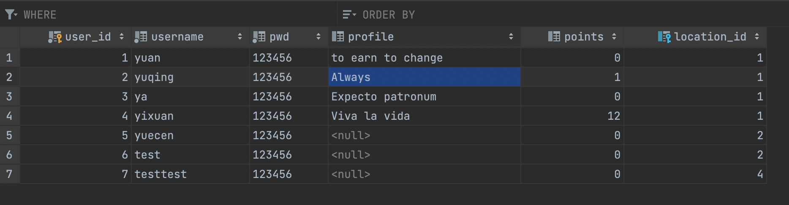

  

- StatusLevel:

  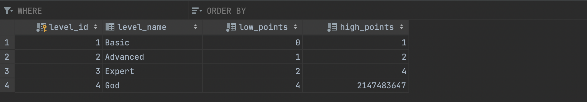

  

- MainCategory:

  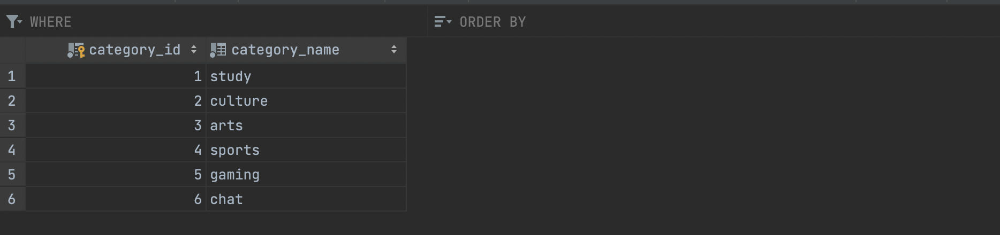

  

- SubCategory:

  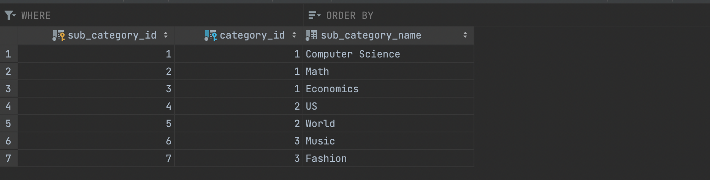

  

- Questions:

  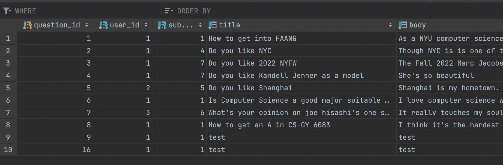

  

- Answers:

  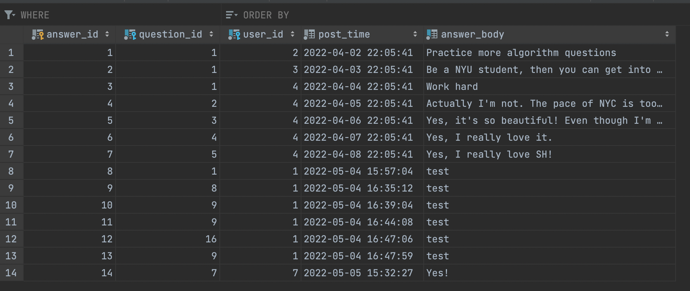

  

- Thumbs:

  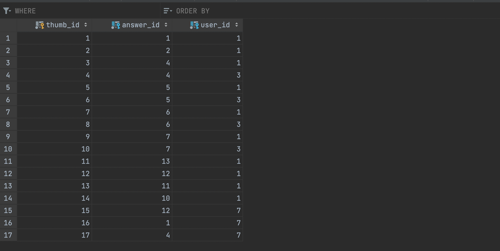

  

- BestAnswer:

  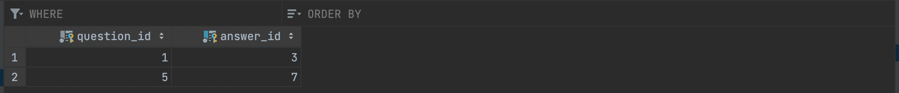

  

## Web Application

### Basic Functions

#### Login/Register

##### **Login** 

1. Users can login with userId and password.

2. Users can not get access to any page of the system before login.

3. After the succes login, the server will send a cookie to the client, and the session of this client will be recorded at the server side.

4. User will be redirect into the home page after registration.

   

Fig 1: The Login Page before user can access any other resource

Fig 2: Both the username and password can't be empty

##### **Register**

1. If a user hasn't had an account yet, they can sign up a new account.

2. Users can regist with username with their password. The system will automatically assign a userId to this user. User can later check their userId in the profile page. Both the username and password can't be empty.

3. Also, New user should select their location during the registration process by using the dropdown.

    

Fig 3: Go to registration page

Fig 4: The registration page

#### **Main Page** 

##### **Navigation Bar**

1. **Navigation bar**: navigation bar contains several parts: dashboard (which can be known as the main page), my questions page, my answers page, category dropdown, search bar, information icon (which contains profile and sign out button).

2. **Dashboard**: dashboard can be also known as the homepage. By clicking on the dashboard button, user will be redirected to the homepage.

3. **My Questions**: by clicking on the my questions, user will be redirected to the my questions page.

4. **My Answers**: by clicking on the my answers, user will be redirected to my answers page.

5. **Category**: by clicking on the categroy button, user will be shown a dropdown containing all the main categories. Then user can click on any of the main category button, the page will be redirected to the page that shows all the questions belongs to this main category.

6. **Search Bar**: user can type some text into the search bar, and the search bar will show the title of the questions that have top 8 questions that have highest relevance base on the title of the question, body of the question and answers of this question. If the user click on the search icon, it will show a page that shows the questions related to this seach text from highest relevance to lowest relevance. If user click outside the search bar, the questions showed related to the search text will be hidden.

7. **Information Icon**: by clicking on the information icon on the top right, user will be shown a dropdown containing profile page button and signout button. By clicking on the profile page button, the page will be redirected to the profile page. By clicking on the sign out button, the session information stored at the server will be removed, and the user will be redirected to the login page.

   
   

Fig 5: The category dropdown

   

Fig 6: The search bar

  

Fig 7: The information icon

##### **Post New Question**

1. User should type in the title and select the category and subcategory of the new question before posting a new question. If they post a new question successfully, the page will alert post the question success.
2. User can decide whether to type the description of the quesiton, so the description is not necessary for posting a new question.

Fig 8: The post new question component

##### **Questions**

1. All questions will be shown in the reverse chronological order.

2. It will show the title, user who posted it, the date question posted, the category and subcategory of the question, and the detail of the question.

3. User can click on the title of the question, and it will redirect to the page that shows this question and all the answers replied to this question.

4. User can click on the category tag or subcategory tag, and it will redirect to the page shwoing the questions belong to this category or subcategory.

    

Fig 9: The questions listed reverse chronologically on the dashboard

#### **My Questions Page**

The my questions page will show all the questions that the user posted in reverse chronological order. Clicking on the title of the question will redirect to the page that shows this question and all the answers replied to this question. Clicking on the category tag or subcategory tag will redirect to the page showing the questions belong to this category or subcategory.

Fig 10: The my questions page

##### Question and Answers

1. If the user is redirected to the page show the question and all the answers replied to this question, user can post an answer to this question. The answer body can't be empty. If the answer to this question, the page will alert post success and refresh the page.
2. User can also give a like to an answer. Users cannot cancel their likes and each user can give only one like to each answer. The number on the right of the thumb icon shows the number of likes that answer receive.

Fig 11: The question and answers replied to it

Fig 12: The post new answer component

#### **My Answers Page**

The my answers page will show all the answers that the user posted in reverse chronological order. Clicking on the "posted in" will redirect to the page that shows this question this answer belongs to and all the answers replied to this question.

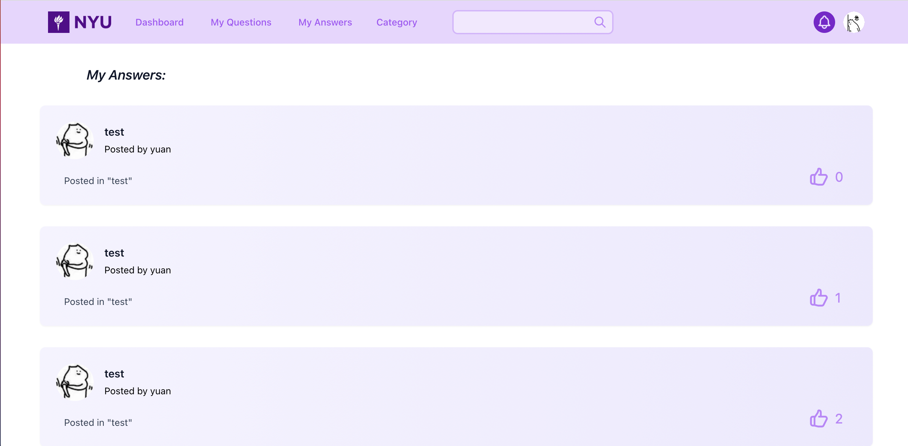

Fig 13: The my answers page

#### **Profile Page**

1. The profile page will show the userId, username, location and the profile of the current user.
2. By clicking on the porfile, it will show that the profile text is actually editable. Then you can edit the profile. By clicking on the update the button, user can update the profile.

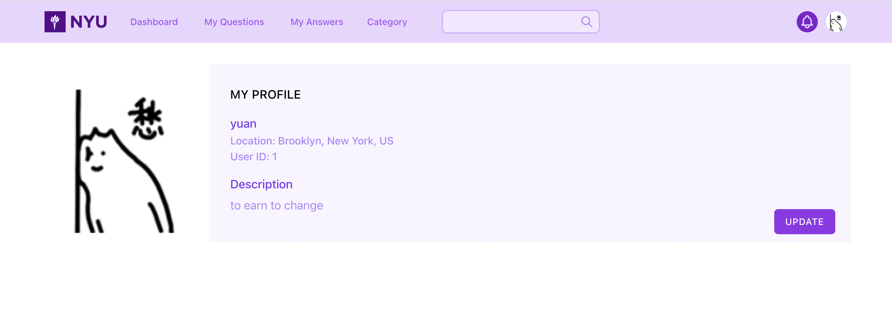

Fig 14: The profile page

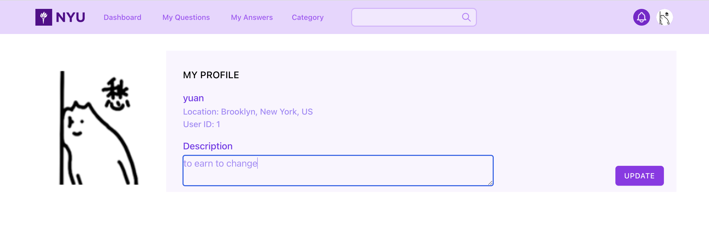

Fig 15: The editable description component

### Technologies

- **Back-end:**

  - Java 11

  - MySQL

  - Spring Boot

  - Spring Security

  - Spring Date JPA

  - Lombok

    

- **Front-end:** 

  - React.js
  - Tailwind CSS
  - Axios